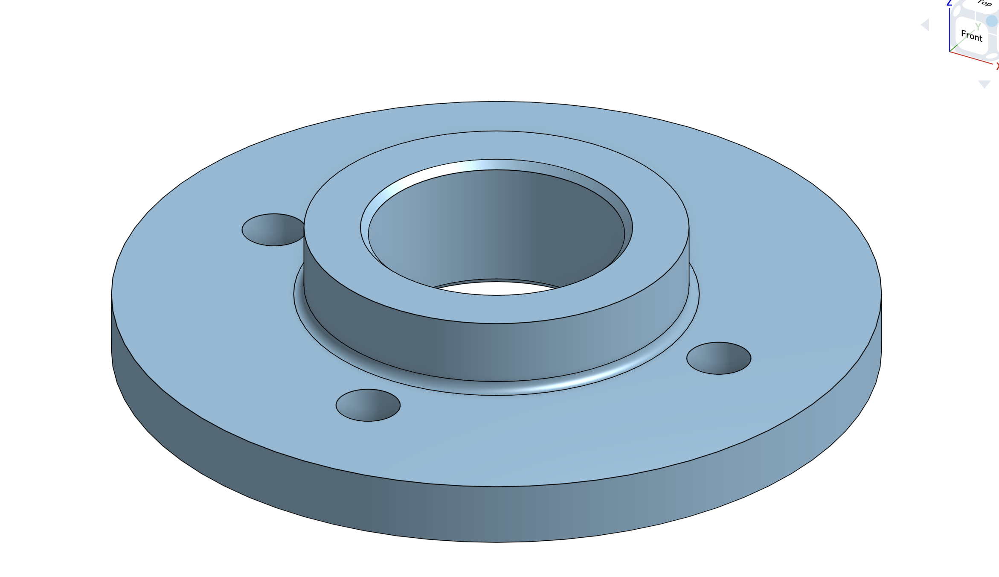

# cadkit — Onshape MCP



Two Model Context Protocol servers for driving [Onshape](https://www.onshape.com) from an LLM:

- **`cadkit`** — the focus of this fork. A part-modeling server built around one idea: every
  part should come out **idiomatic, fully-defined, and variable-driven** — the way a careful
  human models, not a pile of absolute coordinates. One sketch carries its entities, geometric
  constraints, and driving dimensions; it's grounded to the origin and parameterized by
  variables; downstream features select edges and faces by *meaning* (concave edge, cylindrical
  face) rather than by transient ids that break when topology shifts.
- **`onshape_mcp`** — the upstream server this repo forked from ([hedless/onshape-mcp](https://github.com/hedless/onshape-mcp)),
  kept intact. Broader and assembly-focused (mates, instances, interference, export). Reach for
  it when you're assembling parts rather than authoring one.

> Why two servers? `onshape_mcp` is wide; `cadkit` is opinionated. cadkit deliberately emits a
> narrower, stricter shape of geometry so that what you get back is parametric and editable, not
> just *present*. See [PLAN.md](PLAN.md) for the thesis and roadmap.

## Why cadkit models the way it does

A few hard-won principles are baked into the tools (the full list is in [PLAN.md](PLAN.md)):

- **Grounded + dimensioned, or it warns.** `cad_sketch_close` reports whether the sketch is
  grounded to the origin and dimensioned; `require_well_formed=true` refuses to ship an
  under-defined sketch instead of letting the solver place it unpredictably.
- **Variables drive geometry, but only where they earn it.** A dimension, an extrude depth, a
  hole diameter, a fillet radius — all accept a number *or* an expression / `#variable`. Use a
  variable when a value travels beyond one sketch or is derived (`#leg_len - #thick`); use a
  geometric constraint (`equal`, `symmetric`) when the relationship lives *between* entities;
  use a literal for a true one-off.
- **Select by meaning, not by id.** `cad_find_edges` / `cad_find_faces` return deterministic ids
  chosen by geometry (concave edges for fillets, a cylindrical face by radius), so a feature
  keeps referring to the right thing after the model changes.

## The cadkit tools (35)

| Group | Tools |
|---|---|
| **Document / studio** | `cad_document_create`, `cad_part_studio_create` |
| **Sketch session** | `cad_sketch_begin` → `cad_sketch_line` · `cad_sketch_circle` · `cad_sketch_arc` · `cad_sketch_fillet` · `cad_sketch_mirror` · `cad_sketch_pattern` · `cad_sketch_rectangle` · `cad_sketch_polyline` · `cad_sketch_slot` → `cad_sketch_constrain` · `cad_sketch_dimension` · `cad_sketch_analyze` (DOF report / auto-dimension, offline) → `cad_sketch_close` |
| **Variables** | `cad_set_variable` (update-or-create; no duplicates), `cad_get_variables` |
| **Features** | `cad_extrude`, `cad_revolve`, `cad_fillet`, `cad_chamfer`, `cad_shell`, `cad_hole` (simple / counterbore / countersink), `cad_plane` (offset datum plane) |
| **Pattern / mirror** | `cad_mirror`, `cad_pattern` (linear + circular) — *feature-based*: repeat whole features, not faces |
| **Inspection / lifecycle / I/O** | `cad_measure` (count/volume/bbox in one eval), `cad_delete_feature`, `cad_suppress`, `cad_edit_feature`, `cad_export` (STL/STEP/…), `cad_api_calls` (running quota counter) |
| **Semantic selection** | `cad_find_edges` (circular / concave / convex / linear / extreme / on-plane), `cad_find_faces` (planar-by-normal / cylindrical / largest / smallest / extreme / adjacent-to-extreme / on-plane) |

A sketch is one session: `cad_sketch_begin(plane=… | face=<id>)`, add entities, add geometric
constraints + driving dimensions, then `cad_sketch_close`. `cad_pattern` / `cad_mirror` take the
`featureIds` of the features to repeat (e.g. an extrude or hole) plus a direction/axis/plane.

### A small example (L-bracket, parametric)

```
cad_set_variable("leg", "2 in"); cad_set_variable("thick", "0.25 in")
sk = cad_sketch_begin(plane="Front")
#   draw the L profile with cad_sketch_polyline / line, then:
cad_sketch_constrain("ground_origin", a="ln1.start")   # pin to origin
cad_sketch_dimension(kind="length", target="ln1", value="#leg")
# ... fully define ...
cad_sketch_close(require_well_formed=true)              # refuses if under-defined
cad_extrude(sketchFeatureId=sk, depth="#thick", operation="NEW")
```

### Variable-driven centers (no bolt-circle macro needed)

A center moves with a variable only if a *dimension* references that variable. To place a hole at
`(#hx, #hy)`, dimension its center from the origin:

```
cir = cad_sketch_circle(center=[2, 1], radius=0.25)    # nominal spot; the dims drive it
cad_sketch_dimension(kind="diameter", entity=cir, value="#bore")
cad_sketch_dimension(kind="position", entity=cir+".center", value=["#hx", "#hy"])  # H + V dims
```

`kind="position"` emits a horizontal and a vertical distance from the origin (`null` skips an axis);
`kind="distance"` with `direction="horizontal"|"vertical"` does the same between any two entities.
A **bolt circle** is then just a *circular pattern* (`cad_sketch_pattern` / `cad_pattern`) of one
hole whose seed sits on a construction circle dimensioned to `#bcd` — no dedicated feature required.

## Install

Both servers live in this one repo and share the same Onshape client.

```bash
git clone https://github.com/saltyeg/cadkit-mcp.git
cd cadkit-mcp
python -m venv venv && source venv/bin/activate
pip install -e .
```

### Credentials

You need an Onshape API access key + secret key from the
[Onshape Developer Portal](https://dev-portal.onshape.com/). cadkit resolves them in this order:

1. `ONSHAPE_ACCESS_KEY` / `ONSHAPE_SECRET_KEY` environment variables, else
2. the `onshape` MCP server entry already in your `~/.claude.json` (so if you've configured the
   `onshape_mcp` server, cadkit reuses those keys — you never paste them twice).

See `.env.example` for all supported variables.

### OAuth2 (bring your own account)

cadkit also supports OAuth2 — authenticating as the *user* via their own Onshape account instead
of API keys. This is the architecture behind the "bring-your-own-agent" model and the path to an
App Store listing whose calls are exempt from the per-user annual quota. It's optional; API keys
remain the default and nothing changes if you don't use it.

1. Register a **Connected desktop app** (OAuth application) in the
   [Onshape Developer Portal](https://dev-portal.onshape.com/) with:
   - **Redirect URI** `http://localhost:8910/callback` (must match exactly)
   - **Scopes** read, write, delete (`OAuth2Read OAuth2Write OAuth2Delete`)
2. Put the issued credentials in `.env` (or your environment):
   ```
   ONSHAPE_OAUTH_CLIENT_ID=…
   ONSHAPE_OAUTH_CLIENT_SECRET=…
   ```
3. Run the one-time browser handshake:
   ```bash
   cadkit-auth login     # opens the browser, stores tokens at ~/.cadkit/onshape_token.json
   cadkit-auth status    # show token + expiry;  cadkit-auth logout to revoke locally
   ```

Once a token is stored, the cadkit server prefers it over API keys automatically (with silent
refresh). **Caveat:** until the app is *published* in the App Store it's a private OAuth app, so
calls still count against the 2,500/yr quota exactly like API keys — OAuth buys the right
architecture, not quota relief, until launch.

### Register with Claude Code

Add to `~/.claude.json` (or `~/.claude/mcp.json`). The `cadkit` entry can omit keys if the
`onshape` entry already has them:

```json
{
  "mcpServers": {
    "onshape": {
      "command": "/abs/path/to/onshape-mcp/venv/bin/python",
      "args": ["-m", "onshape_mcp.server"],
      "env": { "ONSHAPE_ACCESS_KEY": "…", "ONSHAPE_SECRET_KEY": "…" }
    },
    "cadkit": {
      "command": "/abs/path/to/onshape-mcp/venv/bin/python",
      "args": ["-m", "cadkit_mcp.server"]
    }
  }
}
```

Use the **absolute** path to the venv's Python. **Restart Claude Code** after editing the config
or after any change to the server code (a running server holds the old module until restart).

## API quota — read this before testing

The Onshape **free / standard / education-student** tiers allow **2,500 _successful_ API calls
per user per year** ([limits doc](https://onshape-public.github.io/docs/auth/limits/)). Only
`2xx`/`3xx` responses count — `4xx`/`5xx` are free; `429` is a separate short-term burst limit;
`402` means the annual budget is spent. A naive live test suite drains this fast.

cadkit's development practice is built around that constraint:

- **Offline-first tests.** `tests/test_cadkit_builders.py` asserts on the **JSON the builders
  emit** — parameter ids, enum strings, constraint structure — with **zero** API calls. This
  catches the bug class that actually costs debugging time (a wrong/hidden `parameterId`).
- **`cadkit_mcp/devkit.py`** — quota-frugal live helpers: `ScratchStudio` reuses one part studio
  across checks; `measure_fs` returns bbox / volume / count / sketch bbox / named variables in a
  **single** FeatureScript eval (SOLID-body filtered, inch-converted).
- **One on-demand live smoke** (~6–8 calls), run by hand before a release — only for truths
  offline can't prove (a variable actually *drives* geometry; a concave edge actually fillets).

```bash
# offline builder tests — free, run anytime
venv/bin/python -m pytest tests/test_cadkit_builders.py -o addopts="" -q
```

## Layout

```
cadkit_mcp/
├── server.py     # the cadkit tools + feature JSON builders
├── sketch.py     # SketchSession: entities, constraints, grounding, diagnostics
├── selection.py  # semantic edge/face finders (FeatureScript-backed)
├── quota.py      # successful-call counter behind cad_api_calls
├── hole_template.json  # 160-param native Hole feature template
└── devkit.py     # quota-frugal live verification helpers
onshape_mcp/       # inherited upstream server (assemblies, mates, export) — see git history
tests/            # offline builder tests (zero-API)
PLAN.md           # cadkit thesis + roadmap (P0–P3)
```

## Roadmap

cadkit is ordered so the **parametric core is correct before feature breadth** — see
[PLAN.md](PLAN.md). Shipped (P0–P2): the sketch session, idempotent variables, parametric
scalars everywhere, extrude/revolve/fillet/chamfer/shell/hole, sketch-on-face, feature-based
pattern/mirror, semantic edge/face selection, plus inspection/lifecycle/IO — `cad_measure`,
`cad_get_variables`, `cad_delete_feature`, `cad_suppress`, `cad_edit_feature`, `cad_export`.
In progress (P3): richer semantic selection (largest/smallest/extreme/adjacency/on-plane done;
by-tag next) and sketch ergonomics (slots, center-point arcs, fillets, construction geometry
done; in-sketch mirror live-verified; in-sketch pattern emits geometric copies). Deferred: `cad_rollback`, mass/COM in
`cad_measure`, and tapped threads on the native Hole feature.

## Notes

Not tested on assemblies yet, only individual parts

## Credits

Forked from [hedless/onshape-mcp](https://github.com/hedless/onshape-mcp); the `onshape_mcp`
server and its assembly tooling are upstream's work. Built on the
[Model Context Protocol](https://modelcontextprotocol.io/) and the
[Onshape REST API](https://onshape-public.github.io/docs/). MIT License.
